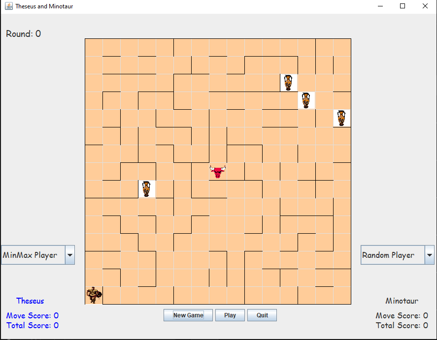
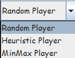

# Theseus and Minotaur
A minigame developed for a 3rd semester course in
Data Structures (Fall 2020), for my undergraduate studies in Electrical and Computer Engineering, Aristotle University of Thessaloniki.

Unfortunately it's a project from my early programming days, and thus it is sketchy, lacks full/proper documentation and doesn't follow the best coding practices. That said, it marks my first experience building a GUI environment from scratch.



## Description
Players can move in every direction (UP, DOWN, LEFT, RIGHT), unless there is a wall, which they cannot penetrate.
 
### Characters:
- **Thesesus** : He tries to collect all the loot placed on the board.  
- **Minotaur** : His goal is to kill Theseus, by stepping onto the same tile as him.

### Player strategies:
- **Random player** : such a player chooses to move (pseudo-)randomly with equal probability in every direction. In fact the strategy is so naive, that if the algorithm selects a prohibited direction due to the presence of a wall, the player loses their turn, and stays on the same spot for that round.
- **Heuristic player** : the player keeps track of a visited set and together with some other strategies (e.g. for Theseus, avoiding the Minotaur if he's nearby) he makes better decisions.
- **MinMax player** : the minmax algorithm is implemented and influences the decision-making for each move.

For the Minotaur character only the Random player implementation is available, whereas for Theseus all 3 are available. You can click on the box with the player strategy and use the drop-down menu to select the strategy you want. You also need to press the **New Game** button for the changes to take place.\


### Buttons:
- **New Game**: Generates a new board, and resets the game. 
- **Play**: Use this button to move the players in each round.
- **Quit**: terminates the program
 


## Requirements 
- **Java Version**: Tested with Java SE 15.0.2. Ensure you have Java 15 or later installed for best compatibility.
- Place all .java files in the same directory 
- The folder containing the .java files must have a subfolder `images` (containing the images for the characters and the loot).
## How to run
```powershell
cd "Your PATH to the folder containing the .java files"
javac *.java
java Game
